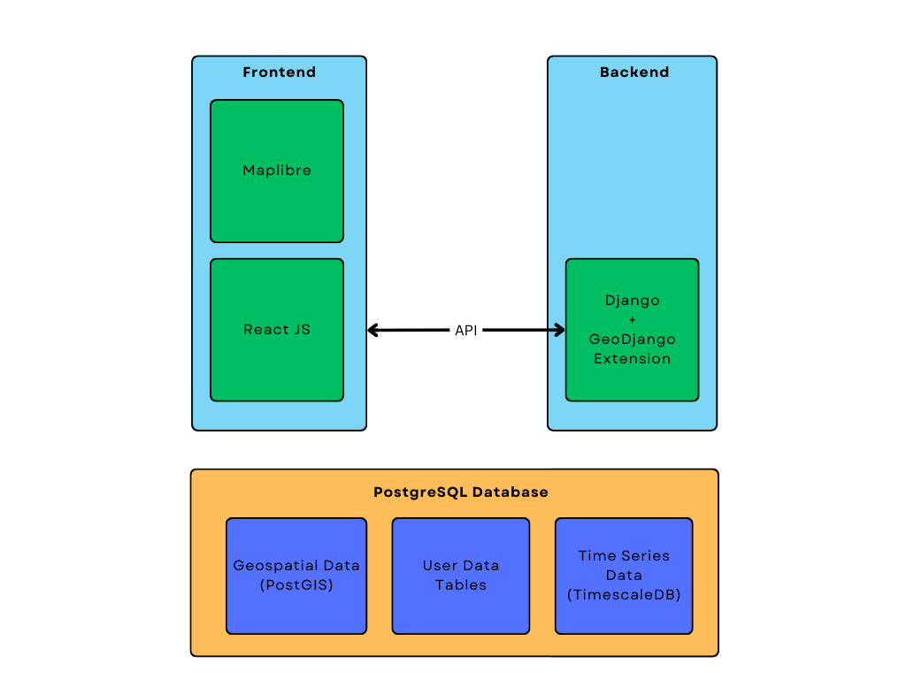

# ABOUT

| CoS-iT-FloWS Links & Badges              |                                                                             |
|------------------------|----------------------------------------------------------------------------------------------------------------------------------------------------------------------------------------------------------|
| CoS-it-FloWS Documentation      |         |
| License                |                                                               |
<!-- | Current Release DOI    |  | -->

----------

This repository serves as the public source code repository of the **Community Sourced Impact Based Flood Forecast and Early Warning System**, termed **CoS-IT-FloWS**. CoS-IT-FloWS documentation can be read on the CoS-IT-FloWS  documentation website.

CoS-IT-FloWS is being developed at EQUINOCT CoSMoS under the UNICEF Office of Innovation's Venture Capital Fund, that supports and guides their inaugural climate cohort of 8 startups from around the world to build Open Source tech solutions for sustainable climate action.
All development activity is coordinated through the CoS-IT-FloWS github page, where you can also find all archived, current, beta, and development versions of the system.

## Overview

CoS-IT-FloWS is a Decision Support System Dashboard that uses real time monitoring to provide hyper local flood forecasting and to issue multi-hazard warnings on a local self government level. It aims at leveraging metereological and infrastructural data such as rainfall, groundwater and reservoir levels to accurately predict region-wise flood probability, utilising both hydrological and machine learning approaches.

## Features

1. Local Self Government level flood vulnerability
2. Real-time community level climate and hydrological data
3. River basin level flood monitoring system
4. Impact based Flood Forecast
5. Multi-hazard warnings
6. Customizable dashboard depending on use-case

## Tech Stack

**Frontend:** React.JS + Maplibre

**Backend:** Django

**Database:** PostgreSQL

## Usage

Each new implementation addresses new problems and conditions that the system may not currently be able to handle, and as such the system is always under development. CoS-IT-FloWS is an open source development project, which means that contributions are welcome, including to the CoS-IT-FloWS documentation.

By placing the original source code archive on GitHub, we hope to encourage a more collaborative development environment. A guide on how to use the CoS-IT-FloWS git repository and [how to contribute](./Contribute.md) your changes to the system can be found on the git page. The most stable version of the system is in the main branch, while beta versions of releases under development can be obtained from the development branches of this repository.

CoS-IT-FloWS has an incremental nature of development due to which not all sections of the code are equally mature and not every combination of system options has been exhaustively tested or is guaranteed to work. While you are more than welcome to use CoS-IT-FloWS in your own research and development undertakings, the system code comes with no guarantees, expressed or implied, as to suitability, completeness, accuracy, and any other claim you would like to make.

If you make use of this system, please acknowledge all references appropriate to the features you used that are cited in the CoS-IT-FloWS Documentation.
